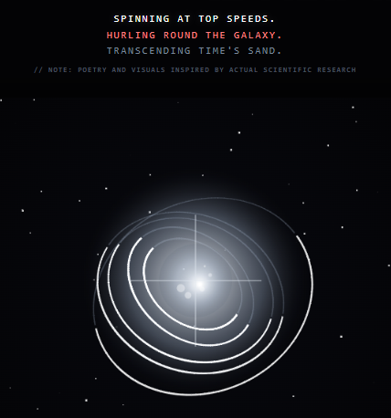

# 🛰️ MOORE SIGNAL // EXHIBIT SPOTLIGHT

---

### 📜 SPACE BROADCASTS // THE PROGRAMME

> **COSMIC SHOWCASE:** *Our upcoming orbital exhibition will beam original artwork directly over the **Pyramids of Giza** via satellite, debuting alongside limited-edition physical prints destined for space flight.*
> 
> **THE ARCHIVE** // This page preserves our extended spacebound art collection. To follow the real-world cosmic token hunt, return to the main **[HUB](https://github.com/Cyber-Chic/cosmos/blob/main/COIN_LEDGER.md)**.

---

### 🎨 POSITION 1 // THE CELESTIAL STAGE

| 🛰️ BROADCAST TRANSMISSION // [SAT GUS](https://tr.ee/P8Bv63Qkk6) |
| :--- |
| **ORIGINAL TARGET:** Satellite Transmission // In Outer Space   **ARCHIVE INITIATIVE:** To Launch an Exhibition Beyond the Globe   **MEDIUM / FORMAT:** Mixed-Media Piece & Featured Artifacts   **PAYLOAD STATUS:** `🟢 MANIFESTED / SLATED FOR BROADCAST` |
|   
  
 |
| **Ledger Entry // Full Composition:** Artwork slated to broadcast over the Pyramids of Giza. Fragmented poetry traces the verso side of each token. |

---

### 📷 POSITION 2 // STUDIO FEATURES & RELEASES

| 📂 ARCHIVE DOCUMENTATION // SNAP-CTTW-001 |
| :--- |
| **EXHIBITION HISTORY:** CT Tech Week Pop-Up Exhibition   **PROVENANCE:** Ely Center for Contemporary Art   **PAYLOAD STATUS:** `🟡 SELECTION IN PROGRESS` |
|   
  
 |
| <a href="images.css/black.jpg">🔍 View Fullsize Asset</a> |

---

| 📂 ARCHIVE DOCUMENTATION // SNAP-CTTW-002 |
| :--- |
| **EXHIBITION HISTORY:** CT Tech Week Pop-Up Exhibition   **PROVENANCE:** Ely Center for Contemporary Art   **PAYLOAD STATUS:** `🟡 SELECTION IN PROGRESS` |
|   
  
 |
| <a href="images.css/black.jpg">🔍 View Fullsize Asset</a> |

---

### 🌌 POSITION 3 // THE GALAXY CAPTURES

| 🪐 COSMIC DATA LOG // TARGET: SKY-DATA |
| :--- |
| **ORIGINAL TARGET:** Sky-Data *(Zooniverse Platform)*   **ARCHIVE INITIATIVE:** Convert research into haiku poetry   **MEDIUM / FORMAT:** Procedurally Mapped Celestial Grid   **PAYLOAD STATUS:** `🔵 MANIFESTED // PRINT QUEUE` |
|   
  
 |
| **Astro-Poetry // Curatorial Text:** *“Spinning at top speeds....”*    <a href="images.css/deep-space-capture-silver-exoplanet.jpg">🔍 View Deep Space Capture</a> |

---

| 🪐 COSMIC DATA LOG // TARGET: WASP-12b |
| :--- |
| **ORIGINAL TARGET:** WASP-12b *(Exoplanet Watch Project)*   **ARCHIVE INITIATIVE:** Convert research into haiku poem   **MEDIUM / FORMAT:** Procedurally Mapped Celestial Grid   **PAYLOAD STATUS:** `🔵 MANIFESTED // PRINT QUEUE` |
|   
  
 |
| **Astro-Poetry // Curatorial Text:** *“Raging hot flames reign....”*    <a href="images.css/deep-space-capture.jpg">🔍 View Deep Space Capture</a> |

---

